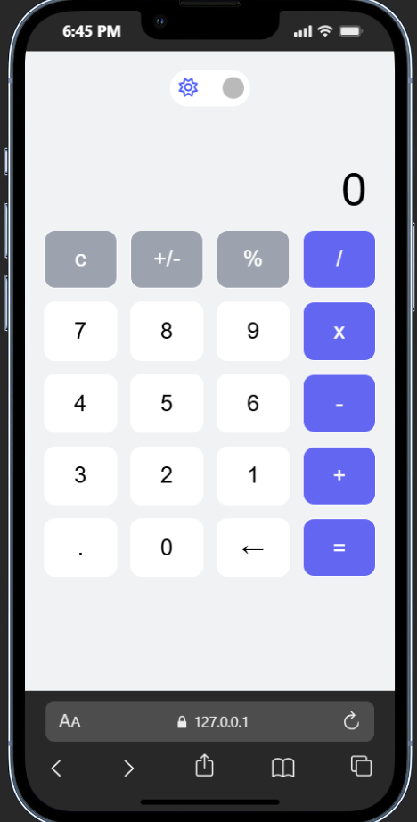
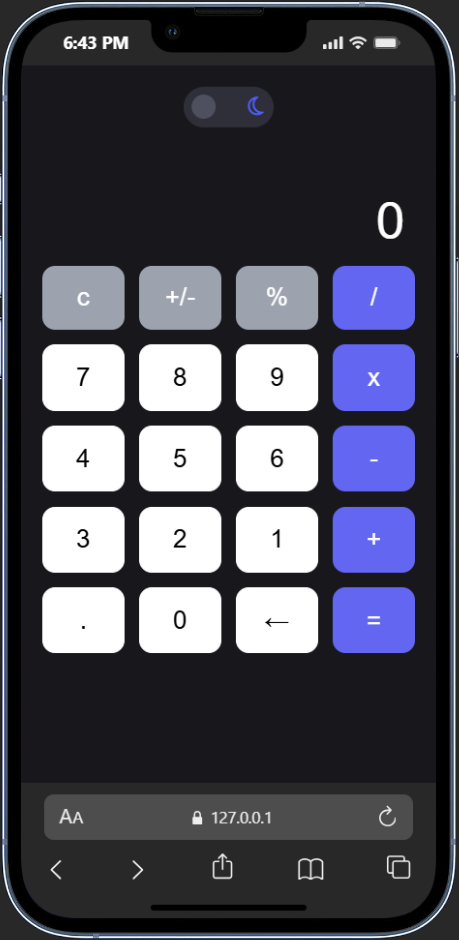

# JavaScript Calculator

A simple yet functional calculator built using Vanilla JavaScript. This project supports all basic arithmetic operations — addition, subtraction, multiplication, and division — with a clean and responsive user interface.

🔧 Features

✅ Perform basic calculations ( + , − , × , ÷ )

🌗 Toggle between light and dark themes

💾 Theme preference saved using localStorage

📱 Responsive design for both desktop and mobile devices

This calculator was built as part of my Modern JavaScript Practice, focusing on:

DOM manipulation

Event handling

UI state management

Using localStorage for persistence

